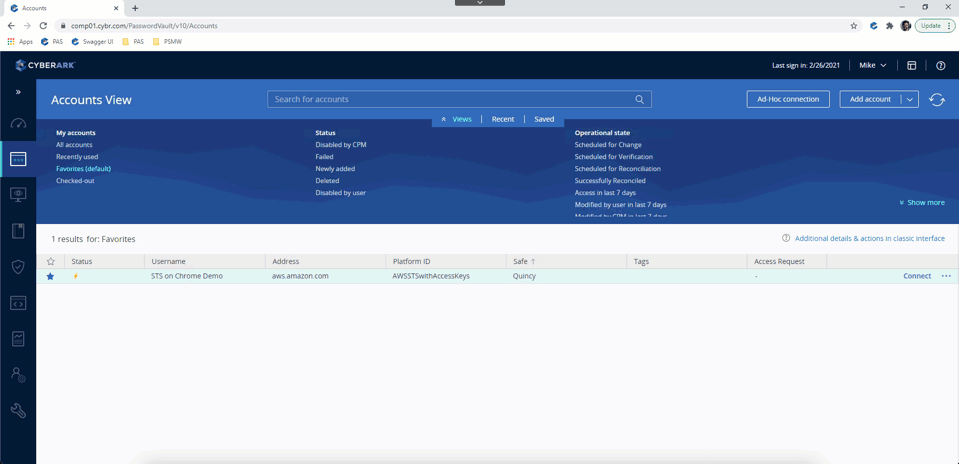

# AWS STS on Chrome Plugin for CyberArk PSM

This PSM plugin allows users to log on to AWS Management Console using AWS STS on Chrome

## How does it work?

1. A web app is deployed to PSM server for handling AWS STS login mechanism
2. Using [Web Applications for PSM](https://docs.cyberark.com/Product-Doc/OnlineHelp/PAS/Latest/en/Content/PASIMP/psm_WebApplication.htm?tocpath=Developer%7CCreate%20extensions%7CPSM%20Connectors%7C_____2), the necessary AWS account info for generating the federation link is passed to the web app 
3. The web app will make use of the `assumeRole` API from [AWS Javascript SDK](https://docs.aws.amazon.com/AWSJavaScriptSDK/latest/AWS/STS.html#assumeRole-property), to generate an encoded session token as temporary, limited-privilege credential
4. The encoded session token is passed to the server-side script to get the AWS sign in token, as well as the federation login URL
5. The user will be redirected to the federation login URL to complete the AWS STS signin process

## System Setup 

1. Copy `/aws_sts` from this repo to `c:\inetpub\wwwroot\` folder on PSM Server.  Please make sure the server role, `Web Server(IIS)` - `Web Server` - `Application Development` - `ASP`, is installed.

2. In PVWA, follow the steps in offical doc to create a new [web application for PSM](https://docs.cyberark.com/Product-Doc/OnlineHelp/PAS/Latest/en/Content/PASIMP/psm_WebApplication.htm?tocpath=Developer%7CCreate%20extensions%7CPSM%20Connectors%7C_____2#Configuration) with the following configuration:

Properties|Value
----------|-----
ID| PSM-AwsStsChrome
Target Settings\ClientApp|Chrome 
Web Form Settings\LogonURL|http://localhost/aws_sts/
Web Form Settings\WebFormFields|access_key>{AWSAccessKeyID} secret_key>{Password} account_id>{AWSAccountID} arn_role>{AWSArnRole} policy>{AWSPolicy} duration>{AWSDuration} session_name>{ClientUserName} next_button>(Button)
Target Settings\RunValidations\Value|No

3. Add the following new user parameter under `User Parameters` of the newly created `PSM-AwsStsChrome` web application for PSM

Name|Value
----|-----
Name|AWSDuration
DisplayName|Session Duration (Seconds)
Value|3600
Visible|Yes
Required|Yes

4. In PVWA, go to administration > platform management to [duplicate platform](https://docs.cyberark.com/Product-Doc/OnlineHelp/PrivCloud/Latest/en/Content/PASIMP/manage-platforms.htm) `Amazon Web Services (AWS) Access Keys` to new platform `AWS STS with Access Keys`

5. Edit the newly created platform `AWS STS with Acess Keys` with the following changes:
   - Add a new `Connection Componments` with `PSM-AwsStsChrome` as `Id`
   - Under `Target Account Platform > UI & Workflow > Properties > Required`, add the following properties

Name|Value
----|-----
AWSPolicy|AWS Policy
AWSArnRole|AWS ARN Role
AWSDuration|AWS Session Duration
Address|Addresss

6. Save the platform

7.  Use `Manage PSM Connectors` feature to select the PSM server through which the connectors will be managed

8. [Activate](https://docs.cyberark.com/Product-Doc/OnlineHelp/PAS/Latest/en/Content/PASIMP/Activating-and-Deactivating-Platforms.htm) `AWS STS with Access Keys` Platform

## Creating Acccounts

[Add an account](https://docs.cyberark.com/Product-Doc/OnlineHelp/PAS/Latest/en/Content/NewUI/NewUI-Add-an-account-in-PVWA.htm) using the newly created `AWS STS with Access Keys` platform, under `Cloud Service` 

Manadatory Properties|Value
---------------------|----
Address|aws.amazon.com
AWS IAM Username|[AWS acccount IAM Username of the access key with AssumeRole permission]
AWS Access Key ID|[AWS acccount access key with AssumeRole permission]
AWS Access Key Secret|[AWS acccount secret key with AssumeRole permission]
AWS Policy|[AWS Policy for STS] For example: { "Version": "2012-10-17", "Statement": [ { "Effect": "Allow", "Action": "*", "Resource": "*" } ] }
AWS Role|[the IAM role]

## FAQ
1. Why not following the standard 2 AWS account setup?

   The offical AWS setup requires a logon account with a custom property.    
   As of 2021 Feb, it is not supported by neither [custom universal connector](https://docs.cyberark.com/Product-Doc/OnlineHelp/PAS/Latest/en/Content/PASIMP/psm_Develop_universal_connector.htm?TocPath=Developer%7CCreate%20extensions%7CPSM%20Connectors%7C_____1) nor  [Web Applications for PSM](https://docs.cyberark.com/Product-Doc/OnlineHelp/PAS/Latest/en/Content/PASIMP/psm_WebApplication.htm?tocpath=Developer%7CCreate%20extensions%7CPSM%20Connectors%7C_____2)

2. Why using both JavaScript & ASP?

   The aim here is to leverage on language supported on IIS from the standard component server setup.
   ASP.NET or ASP.NET core is not considered due to the complexity on web app deployment
   AWS JavaScript SDK works great for getting session token, but will cause CORS issues when it comes to getting the signin token, hence ASP is used to handle the mechanism to get the sign-in token & federation login link

3. What if the same access key & secret key pair is used for multiple roles logon?

   [Account group](https://docs.cyberark.com/Product-Doc/OnlineHelp/PAS/Latest/en/Content/PASIMP/Account-Groups.htm) can be used which secrets are managed together
